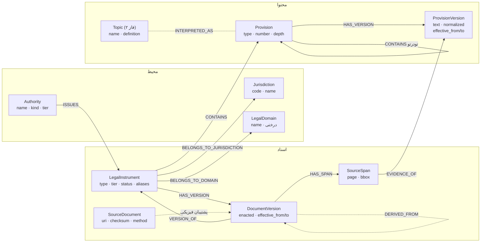
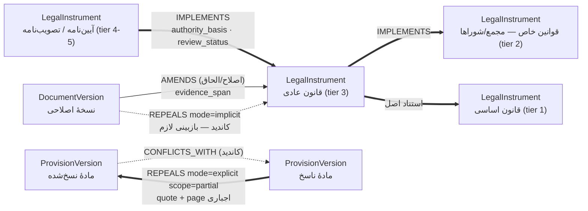
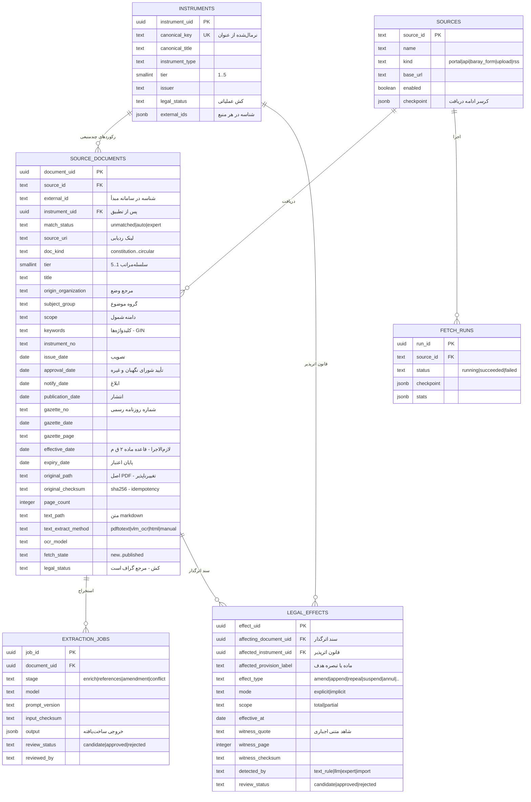
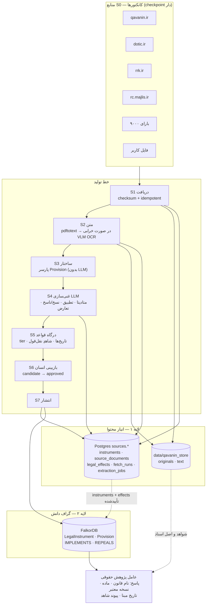

# ۰۴ — نمودارها (Mermaid)

چهار نما: ۱) اسکیمای گراف ۲) یال‌های رابطه‌ای ۳) دیتابیس رابطه‌ای `sources.*` ۴) معماری سه‌لایه و خط تولید.

## ۱. گراف دانش — اسکیمای نودها

> واحد بازیابی برای LLM همین `ProvisionVersion` است (نه کل قانون): جستجوی واژگانی + برداری،
> سپس پالایش با بازه اعتبار و پیمایش روابط.

## ۲. گراف دانش — یال‌های رابطه‌ای میان اسناد (نسخ/ناسخ و سلسله‌مراتب)

قاعدهٔ جهت‌دار: هر یال فقط **یک جهت** ذخیره می‌شود (`REPEALS`)؛ معکوس (`REPEALED_BY`) در زمان پرس‌وجو خوانده می‌شود — ذخیرهٔ هر دو، خطر ناسازگاری دارد.

## ۳. دیتابیس رابطه‌ای — `sources.*`

جریان انتشار: `legal_effects (approved)` منشأ یال‌های `AMENDS/REPEALS` گراف است؛ `instruments` هدف نشر به `(:LegalInstrument)`. ساختار مواد و «وضعیت در تاریخ X» عمداً فقط در گراف زندگی می‌کند تا یک منبع حقیقت داشته باشیم.

## ۴. معماری اصلی — سه لایه و خط تولید

قاعدهٔ سراسری: هیچ داده‌ای بدون گذر از S5 و S6 وارد گراف قطعی نمی‌شود؛ اصل فایل همیشه قبل از هر پردازش LLM در لایه ۱ ذخیره شده است؛ پاسخ نهایی بدون «نام قانون + ماده + نسخه + تاریخ مبنا + شاهد» منتشر نمی‌شود.
